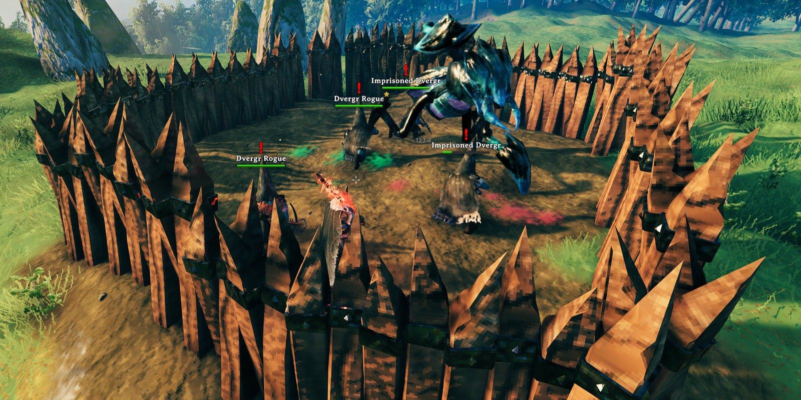

# DvergrForHire

[](https://github.com/algo7/DvergrForHire/actions/workflows/ci.yml)



A client-side [BepInEx](https://github.com/BepInEx/BepInEx) mod for Valheim: hire the game's own Dvergr with coins as
mercenaries. Players without the mod only ever see vanilla things.

What it does for players is in [package/README.md](package/README.md), which is also the mod's Thunderstore page.
Changes: [CHANGELOG.md](CHANGELOG.md).

Made with AI assistance.

## How it works

### Dvergr are already fighters

Every Dvergr (`Dverger`, the four mage prefabs, `DvergerAshlands`, `DvergerDeepNorth`) is a `Humanoid` with a
`MonsterAI` and weapons, i.e. built like the vanilla tameables. On each world load (Unity's `sceneLoaded`, after
`ZNetScene.Awake` registered the prefabs and before any creature exists) each prefab gets, in place:

- a vanilla `Tameable`: commandable (E = follow / stay, Shift+E = rename), with the Dvergr's own voice on E. It's never
  fed (`m_consumeItems` stays empty), so vanilla taming never starts;
- a `Mercenary` component with the price.

A pre-flight checks every prefab, field and effect first, and that no other mod already gave the Dvergr a `Tameable`;
on any miss the Dvergr are left alone and the log says why.

### Hiring

Two Harmony patches: a postfix on `Tameable.GetHoverText` (the price on wild Dvergr, nothing on provoked ones,
"( Hired )" on hired ones) and a prefix on `Tameable.Interact` (E on a wild, unprovoked Dvergr pays from the player's
inventory, as Haldor's shop does, and hires it). The hire is the game's own `Character.SetTamed`, an RPC that whichever
game runs the Dvergr handles, with or without the mod. Then "follow me" (`Tameable.Command`).

### The provokable flag

`BaseAI.m_aggravatable` keeps the Dvergr neutral until a player provokes them, and it lets any player weapon hit them:

```csharp
flag = BaseAI.IsEnemy(attacker, target) || (target.GetBaseAI().IsAggravatable() && attacker.IsPlayer());
```

`Mercenary` clears the flag on hired Dvergr (in every modded game's copy, since the check runs on the attacker's
machine) and sets it again on wild ones. Tamed creatures are never enemies of players and never target a player who
hits them, so a hired Dvergr never attacks players either way.

### Buildings

A mage's fireball, cluster bomb and ice bolt explode in a 3 m blast that damages every building piece in range
(`Projectile.DoAOE` checks friend or enemy for creatures only); stray bolts and melee swings hit pieces too. A prefix on
`WearNTear.Damage` drops hits whose attacker is a hired Dvergr. A support mage's mistiles are their own creatures (summoned by
`SpawnAbility`), so their explosions aren't the mage's hits: a prefix on `SpawnAbility.FindTarget` and a postfix on
`Character.Awake` mark each mistile a hired Dvergr summons (`DvergrForHire_HiredSummon`), and marked attackers are dropped
too. It runs where the hit is worked out: the game running
the Dvergr and its projectiles.

### Hiring posts

Six hammer entries are local copies of the vanilla Dvergr lantern pole (kept in a disabled holder, so they never become
world objects) with their own name and cost: the pole's own cost plus materials from the Dvergr's home biome. A prefix on
`Player.PlacePiece` places the real vanilla pole instead of the copy, and a postfix on `Piece.SetCreator` marks it with a
hidden key (`DvergrForHire_Post`, the kind). The placing game then creates the recruiter: the vanilla Dvergr of that
kind, tamed, told to stay (its patrol point), marked with a hidden key (`DvergrForHire_Recruiter`). The pole links its
recruiter with a vanilla "Spawned" connection, the way a creature spawner links its creature: object ids change on every
world load, and the game re-links connections on load (`ZDOMan.ConnectSpawners`). The recruiter finds its pole by
scanning the zones around it. A `HiringPost` component on the vanilla pole prefab gives marked poles a hover text and E
(the stars for the next hire, kept locally); unmarked poles stay vanilla. E on a recruiter pays and creates a new Dvergr
of its kind in front of the player, tamed and following. A recruiter whose pole is gone, or a pole whose recruiter died,
is removed (the pole breaks with vanilla `WearNTear.Remove`) after 10 s, counted only while the game has the whole area
loaded (`ZNetScene.IsAreaReady`). Players without the mod see a vanilla lantern pole and a tamed Dvergr.

### Who runs a Dvergr

Valheim simulates each creature on one machine, the owner of its ZDO. A game without the mod runs a hired Dvergr as a
vanilla one: it stays tamed but doesn't follow. (Whether a weapon can hit it is decided by the attacker's game: players
without the mod can, whoever runs the Dvergr.) So, as in
[SealsAtHome](https://github.com/algo7/SealsAtHome), a modded game that runs a hired Dvergr stamps a hidden heartbeat on
it every 10 s (`DvergrForHire_Beat`), and a modded game that sees neither the owner nor the heartbeat change for 30 s of
real time claims it (`ZNetView.ClaimOwnership`) and remembers that player for 5 minutes. Wild Dvergr act the same with or
without the mod, so they're never claimed. The hiring game also re-sends "follow me" once a modded game runs the Dvergr
(`Command` toggles follow, so never twice to the same game). Names are copied into the vanilla override-name field, so
players without the mod see them. All decisions are unit-tested rules (`src/HireRules.cs`, `src/MultiplayerRules.cs`).

## Building

Needs the .NET SDK 8 and Valheim's game DLLs for compile-time references: by default from a local Steam install
(`~/.local/share/Steam/steamapps/common/Valheim`). BepInEx and HarmonyX come from NuGet (`nuget.config` adds the BepInEx
feed).

```sh
make test       # unit tests (no game needed at runtime, only its DLLs as references)
make package    # → Algo7-DvergrForHire-<version>.zip (manifest.json is generated from DvergrForHire.csproj)
make test MANAGED_DIR=/path/to/Valheim/valheim_Data/Managed    # game DLLs from elsewhere
```

Install the zip with r2modman ("Import local mod"), or copy `DvergrForHire.dll` into `BepInEx/plugins/`.
The Makefile looks for the SDK in `~/.dotnet`; pass `DOTNET=dotnet` if it's on your PATH.

## CI / CD

- **CI** (`.github/workflows/ci.yml`, every push and pull request): build, unit tests and the zip as an artifact. The
  game DLLs come from Valheim's free dedicated server (Steam app 896660, anonymous login): only its `Managed` DLLs,
  fetched with [DepotDownloader](https://github.com/SteamRE/DepotDownloader) (pinned, checksum-verified); nothing from
  the game is committed.
- **Release** (`.github/workflows/release.yml`): the version comes from the git tag
  ([MinVer](https://github.com/adamralph/minver)). To release:
  1. add a `## X.Y.Z` section to [CHANGELOG.md](CHANGELOG.md), above the previous release's section, and push it;
  2. tag that commit: `git tag vX.Y.Z && git push origin vX.Y.Z`;
  3. approve the run in the `thunderstore` environment: it creates the GitHub Release and publishes the same zip to
     Thunderstore (`tcli`, secret `TCLI_AUTH_TOKEN`).
- **Dependabot**: NuGet packages and GitHub Actions, weekly.

## Layout

```
DvergrForHire.csproj       net48 plugin; Package target (zip + generated manifest)
src/                       plugin: scene hook, prefab setup, Mercenary (+ recruiter mode), hiring posts, Harmony patches, settings and rules
package/                   Thunderstore README and icon (icon.svg is its source)
images/                    screenshots for the READMEs (not in the zip)
tests/                     unit tests (net8.0)
thunderstore.toml          Thunderstore publishing settings (tcli)
.github/                   workflows, Dependabot, the CI helper that fetches the game DLLs
```

## License

[MIT](LICENSE)
